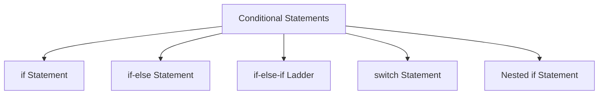
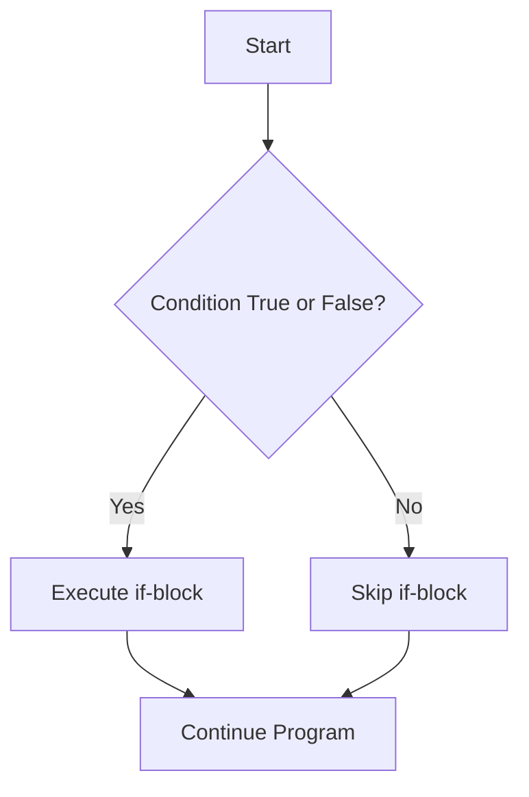

# 🔢 Java Operators

Operators are special symbols that perform operations on variables and values. Java supports a wide range of operators to perform various operations.

## 📂 Table of Contents

- [Arithmetic Operators](#arithmetic-operators)
- [Relational (Comparison) Operators](#relational-comparison-operators)
- [Logical Operators](#logical-operators)
- [Assignment Operators](#assignment-operators)
- [Unary Operators](#unary-operators)
- [Bitwise Operators](#bitwise-operators)
- [Ternary Operator](#ternary-operator)
- [Instanceof Operator](#instanceof-operator)

---

## Arithmetic Operators

Used to perform basic mathematical operations:

| Operator | Description      | Example      |
|----------|------------------|--------------|
| `+`      | Addition          | `a + b`      |
| `-`      | Subtraction       | `a - b`      |
| `*`      | Multiplication    | `a * b`      |
| `/`      | Division          | `a / b`      |
| `%`      | Modulus (remainder) | `a % b`    |

---

## Relational (Comparison) Operators

Used to compare two values:

| Operator | Description          | Example     |
|----------|----------------------|-------------|
| `==`     | Equal to             | `a == b`    |
| `!=`     | Not equal to         | `a != b`    |
| `>`      | Greater than         | `a > b`     |
| `<`      | Less than            | `a < b`     |
| `>=`     | Greater than or equal to | `a >= b` |
| `<=`     | Less than or equal to    | `a <= b` |

---

## Logical Operators

Used to combine multiple boolean expressions:

| Operator | Description | Example         |
|----------|-------------|-----------------|
| `&&`     | Logical AND | `a > 5 && b < 10` |
| `||`     | Logical OR  | `a > 5 || b < 10` |
| `!`      | Logical NOT | `!(a > 5)`        |

---

## Assignment Operators

Used to assign values to variables:

| Operator | Description        | Example     |
|----------|--------------------|-------------|
| `=`      | Assign              | `a = 10`    |
| `+=`     | Add and assign      | `a += 5`    |
| `-=`     | Subtract and assign | `a -= 3`    |
| `*=`     | Multiply and assign | `a *= 2`    |
| `/=`     | Divide and assign   | `a /= 4`    |
| `%=`     | Modulus and assign  | `a %= 3`    |

---

## Unary Operators

Operate on a single operand:

| Operator | Description      | Example     |
|----------|------------------|-------------|
| `+`      | Unary plus       | `+a`        |
| `-`      | Unary minus      | `-a`        |
| `++`     | Increment        | `a++` or `++a` |
| `--`     | Decrement        | `a--` or `--a` |
| `!`      | Logical complement | `!true`   |

---

## Bitwise Operators

Perform operations on bits:

| Operator | Description        | Example      |
|----------|--------------------|--------------|
| `&`      | AND                 | `a & b`      |
| `|`      | OR                  | `a | b`      |
| `^`      | XOR                 | `a ^ b`      |
| `~`      | One's complement    | `~a`         |
| `<<`     | Left shift          | `a << 2`     |
| `>>`     | Right shift         | `a >> 2`     |
| `>>>`    | Zero-fill right shift | `a >>> 2` |


## Ternary Operator

Shortcut for `if-else`:

```java
int result = (a > b) ? a : b;
```

## instanceof Operator

Checks if an object is an instance of a specific class or subclass:

```Java
if (obj instanceof String) {
    System.out.println("It's a string!");
}
```

<b>Program</b>

```Java
public class JavaOperatorsDemo {
    public static void main(String[] args) {
        // 1. Arithmetic Operators
        int a = 10, b = 3;
        System.out.println("Arithmetic Operators:");
        System.out.println("a + b = " + (a + b)); // 13
        System.out.println("a - b = " + (a - b)); // 7
        System.out.println("a * b = " + (a * b)); // 30
        System.out.println("a / b = " + (a / b)); // 3
        System.out.println("a % b = " + (a % b)); // 1

        // 2. Relational Operators
        System.out.println("\nRelational Operators:");
        System.out.println("a == b: " + (a == b)); // false
        System.out.println("a != b: " + (a != b)); // true
        System.out.println("a > b: " + (a > b));   // true
        System.out.println("a < b: " + (a < b));   // false
        System.out.println("a >= b: " + (a >= b)); // true
        System.out.println("a <= b: " + (a <= b)); // false

        // 3. Logical Operators
        boolean x = true, y = false;
        System.out.println("\nLogical Operators:");
        System.out.println("x && y: " + (x && y)); // false
        System.out.println("x || y: " + (x || y)); // true
        System.out.println("!x: " + (!x));         // false

        // 4. Assignment Operators
        int c = 5;
        System.out.println("\nAssignment Operators:");
        c += 3; // c = c + 3
        System.out.println("c += 3: " + c); // 8
        c -= 2;
        System.out.println("c -= 2: " + c); // 6
        c *= 4;
        System.out.println("c *= 4: " + c); // 24
        c /= 6;
        System.out.println("c /= 6: " + c); // 4
        c %= 3;
        System.out.println("c %= 3: " + c); // 1

        // 5. Unary Operators
        int d = 5;
        System.out.println("\nUnary Operators:");
        System.out.println("+d: " + (+d));  // 5
        System.out.println("-d: " + (-d));  // -5
        System.out.println("d++: " + (d++)); // 5 (post-increment)
        System.out.println("Now d: " + d);   // 6
        System.out.println("++d: " + (++d)); // 7 (pre-increment)
        System.out.println("d--: " + (d--)); // 7 (post-decrement)
        System.out.println("--d: " + (--d)); // 5

        // 6. Bitwise Operators
        int m = 5, n = 3;
        System.out.println("\nBitwise Operators:");
        System.out.println("m & n: " + (m & n));  // 1
        System.out.println("m | n: " + (m | n));  // 7
        System.out.println("m ^ n: " + (m ^ n));  // 6
        System.out.println("~m: " + (~m));        // -6
        System.out.println("m << 1: " + (m << 1)); // 10
        System.out.println("m >> 1: " + (m >> 1)); // 2
        System.out.println("m >>> 1: " + (m >>> 1)); // 2

        // 7. Ternary Operator
        int num1 = 10, num2 = 20;
        int max = (num1 > num2) ? num1 : num2;
        System.out.println("\nTernary Operator:");
        System.out.println("Max of num1 and num2 is: " + max); // 20

        // 8. instanceof Operator
        String text = "Hello";
        System.out.println("\ninstanceof Operator:");
        System.out.println("Is 'text' a String? " + (text instanceof String)); // true
    }
}
```

<b>Output</b>
```
Arithmetic Operators:
a + b = 13
a - b = 7
a * b = 30
a / b = 3
a % b = 1

Relational Operators:
a == b: false
a != b: true
a > b: true
a < b: false
a >= b: true
a <= b: false

Logical Operators:
x && y: false
x || y: true
!x: false

Assignment Operators:
c += 3: 8
c -= 2: 6
c *= 4: 24
c /= 6: 4
c %= 3: 1

Unary Operators:
+d: 5
-d: -5
d++: 5
Now d: 6
++d: 7
d--: 7
--d: 5

Bitwise Operators:
m & n: 1
m | n: 7
m ^ n: 6
~m: -6
m << 1: 10
m >> 1: 2
m >>> 1: 2

Ternary Operator:
Max of num1 and num2 is: 20

instanceof Operator:
Is 'text' a String? true

```
<br>
<br>
<hr>
<hr>

# 🔀 Conditional Statements in Java

Conditional statements are used to control the flow of a program based on certain conditions.


## 📚 Table of Contents

- [What are Conditional Statements?](#what-are-conditional-statements)
- [if Statement](#1-if-statement)
- [if-else Statement](#2-if-else-statement)
- [if-else-if Ladder](#3-if-else-if-ladder)
- [switch Statement](#4-switch-statement)
- [Nested if Statement](#5-nested-if-statement)
- [Important Points](#important-points)


## What are Conditional Statements?

Conditional statements execute a block of code only when a specific condition is `true`. They are fundamental for implementing decision-making in Java programs.



Java supports:

- `if`
- `if-else`
- `if-else-if` ladder
- `switch`
- Nested `if`

---

## 1if Statement



### Definition

Executes a block of code **only if** the condition evaluates to `true`.

### 🧑‍💻 Example

```java
int num = 10;

if (num > 0) {
    System.out.println("Number is positive");
}
