```mermaid
graph TD

A[Performance Comparison]

A1[Divide and Conquer]
A2[Non Divide and Conquer]

A --> A1
A --> A2

A1_1[Increasing Order]
A1_2[Decreasing Order]
A1_3[Random Case]

A2_1[Increasing Order]
A2_2[Decreasing Order]
A2_3[Random Case]

A1 --> A1_1
A1 --> A1_2
A1 --> A1_3

A2 --> A2_1
A2 --> A2_2
A2 --> A2_3

A1_1v["(3n/2 - 2)"]
A1_2v["🔴 (3n/2 - 2)"]
A1_3v["🔴 (3n/2 - 2)"]

A2_1v["🔴 (n - 1)"]
A2_2v["2(n - 1)"]
A2_3v["(3n/2 - 1)"]

A1_1 --> A1_1v
A1_2 --> A1_2v
A1_3 --> A1_3v

A2_1 --> A2_1v
A2_2 --> A2_2v
A2_3 --> A2_3v


```

# Divide and Conquer

<ol> 
  <li>When the problem becomes large/complex, then divide the problem into sub-problems, into further sub-problems, until the sub-problem becomes small.</li> 
  <li>Solve the smaller problems, combine their results if required to get the solution of the original problem.</li> 
  <li>In general, a problem is said to be <b>small</b> if it can be solved in one or two basic operations.</li> 
</ol>

```Algorithm
    Algorithm DAndC(P){
        if Small(P) then return S(P);
        else{
          divide P into smaller instances P1,P2,P3...,Pk , (k>=1);
          Apply DAndC to each of these subproblems;
          return Combine(DAndC(P1),DAndC(P2),...,DAndC(PK),);
  }
}

```

<li><b>Control abstraction</b> in algorithms refers to hiding the details of control flow (such as loops, conditionals, recursion, etc.) so that the algorithm focuses more on what needs to be done rather than how it’s done step by step. It helps improve readability, modularity, and reusability.</li>
  Example:- Small(P)


<hr/>

### Example : Finding the largest element in an array.

```mermaid
graph TD
    A["Array: 3, 9, 2, 5, 7, 6, 1, 8"]
    A --> B1["Left Half: 3, 9, 2, 5"]
    A --> B2["Right Half: 7, 6, 1, 8"]

    B1 --> C1["Left: 3, 9"]
    B1 --> C2["Right: 2, 5"]

    B2 --> C3["Left: 7, 6"]
    B2 --> C4["Right: 1, 8"]

    C1 --> D1["Compare 3 & 9 → Max = 9"]
    C2 --> D2["Compare 2 & 5 → Max = 5"]
    C3 --> D3["Compare 7 & 6 → Max = 7"]
    C4 --> D4["Compare 1 & 8 → Max = 8"]

    D1 --> E1["Max(9, 5) = 9"]
    D2 --> E1

    D3 --> E2["Max(7, 8) = 8"]
    D4 --> E2

    E1 --> F["Final Max(9, 8) = 9"]
    E2 --> F
```



**Algorithm**

```Algorithm
Function Find-Max(A, low, high)
    // Base Case
    If low == high then
        Return A[low]

    // Divide
    mid ← ⌊(low + high) / 2⌋

    // Conquer
    max1 ← Find-Max(A, low, mid)
    max2 ← Find-Max(A, mid + 1, high)

    // Combine
    If max1 > max2 then
        Return max1
    Else
        Return max2
End Function
```

## Time-Complexity Framework for Divide and Conquer Problems 

<ol>
  <li>Let T(n) represents the time complexity of a Divide and Conquer algorithm.</li>
  <li><b>If n is small :</b></li>
    <ul>
      <li>T(n)=f(n),where :</li>
        <ol><li>f(n)=O(1) or Constant ( for base case)</li></ol>
    </ul>
  <li><b>If n is large :</b></li>
    <ul>
      <li>T(n)=2T(n/2)+g(n)</li>
      <li>Here,</li>
        <ol>
          <li>2 = number of sub-problems</li>
          <li>n/2 = size of each sub-problems</li>
          <li>g(n) = time for dividing , combining , and small task</li>
        </ol>
    </ul>

  <li><b>General form:</b></li>
    <ol>
      <li>T(n)=a.T(n/b)+g(n)</li>
      <li>Here,</li>
      <ul>
        <li> a>=1 , b>1 </li>
        <li>a = number of sub-problems</li>
        <li>n/b = size of each sub-problems</li>
        <li>g(n) = time for dividing , combining , and small task</li>
      </ul>
    </ol>
    <li> Example <b>Symmetric :-</b></li>
      <ul>
        <li>T(n)=2T(n/2)+g(n)</li>
        <li>T(n)=T(n/2)+g(n)</li>
        <li>T(n)=4T(n/2)+g(n)</li>
      </ul>
    <li><b> Asymmetric :-</b></li>
     <UL>
       <LI>General Form:
            T(n) = T(αn) + T((1-α)n) + g(n)
            , where 0 < α < 1</LI>
        <LI>Case 1:T(n) = T(n/3) + T(2n/3) + g(n)</LI>
        <LI>Case 2:T(n) = T(n/2) + T(n/4) + g(n)</LI>
     </UL>
</ol>



<hr/>

<li><B>NOTE :- </B> In Divide and Conquer strategy, <b>Divide is mandatory</b> but combine is optional(Depends on application). </li> 

```mermaid
graph TD
    A["T(n): Time Complexity<br>of Divide & Conquer <br>Algorithms"]

    A --> B["Symmetric Case"]
    B --> C1["General Form:<br><br>T(n) = a · T(n/b) + g(n)"]
    C1 --> D1["a ≥ 1, b > 1"]
    C1 --> D2["a = number of sub-problems"]
    C1 --> D3["n/b = size of each sub-problem"]
    C1 --> D4["g(n) = time for dividing, combining, and small task"]

    A --> E["Asymmetric Case"]
    
    E --> F1["General Form:<br><br>T(n) = <br>T(α·n) + T((1−α)·n) + g(n)<br>where 0 < α < 1"]
    
    F1 --> F2["Case 1:<br><br>T(n) = T(n/3) + T(2n/3) + g(n)"]
    
    F1 --> F3["Case 2:<br><br>T(n) = T(n/2) + T(n/4) + g(n)<br>where 0 < α < 1"]

    %% Styling to increase box size
    classDef wide fill:#f9cb9c,stroke:#333,stroke-width:2px,font-size:16px;
    classDef symmetric fill:#c6e2ff,stroke:#333,stroke-width:2px,font-size:14px;
    classDef header fill:#ffd966,stroke:#333,stroke-width:3px,font-size:18px;

    class A header;
    class B,C1,D1,D2,D3,D4 symmetric;
    class E,F1,F2,F3 wide;


```

  Exaple :-  Binary Search , Quick sort

</br>
</hr>

## 1. Finding MaxMin
<li>Procedure to find the maximum and minimum (simultaneously) in an arrway of size 'n'.</li>

<p><strong>METHOD-1 : Non-Divide and Conquer Approach</strong></p>

<b>1. Non Divide and Conquer Approach</b>
```Algorithm
  Algorithm MaxMin(A,n,max,min){
    max <- min <- A[0];
    for i <- 1 to n{
      if(A[i]>max)
        max <- A[i];
      endif
      if(A[i]<min)
        min <- A[i];
      endif
}
}
```

<li>Here, <b>metric:</b> Comparision </li>


<b>Total number of element comparison made in Non-DAndC (MaxMin()) = 2*(n-1)  (for all cases)</b>

### Can we reduce the number of comparison ?
```Algorithm
  Algorithm MaxMin(A,n,max,min){
    max <- min <- A[0];
    for i <- 1 to n{
      if(A[i]>max)
        max <- A[i];
      endif
      else{
        if(A[i]<min)
          min <- A[i];
        endif
    }
  }
}
```

<li>Now, number of element comparison :</li>
<ol>
  <li><b>Best-case :-</b> (Increasing order) = (n-1) </li>
  <li>Worst-case :-</b> (Decreasing order) = 2*(n-1)</li>
  <li>Average-case :-</b></li>
    <ul>
      <li>Case :- On an average first comparison fails for 1/2 of given elements (n) </li>
      <li>First Comparison + Second Comparison</li>
      <li>(n-1)+n/2</li>
      <li><b>Total comparison =</b> ((3n/2)-1)</li>
    </ul>
</ol>

<table>
    <tr>
        <th></th>
        <th>1st Comp.</th>
        <th>2nd Comp.</th>
        <th>Total</th>
    </tr>
    <tr>
        <td>1) Best Case</td>
        <td>(n-1)</td>
        <td>0</td>
        <td>(n-1)</td>
    </tr>
    <tr>
        <td>2) Worst Case </td>
        <td>(n-1)</td>
        <td>(n-1)</td>
        <td>2(n-1)</td>
    </tr>
    <tr>
        <td>3) Avgerage Case</td>
        <td>(n-1)</td>
        <td>n/2</td>
        <td>((3n/2) - 1)</td>
    </tr>
</table>
<p><strong>Time: O(n)</strong></p>

<p><strong>METHOD-2 : Divide and Conquer Approach</strong></p>


<B>Note:- (Tree structure description)</b>


<b>Divide and Conquer Tree </b>


Solution :


MAX = 64 , MIN = -6

<B>Algorithm</b>
```Algorithm

```

<b> Performance Comparison </b>
<li>Time Complexity : </li>


<li>Space Complexity : </li>


<hr/>

## 2. Binary Search

<li>The primary requirement is that the list of n-elements must be in sorted order.</li>
<li>mid = [(lowindex+highindex)/2]</li>

### Example 
  A <1 , 2 , 3 , 4 , 5 , 6 , 7>   n=7 , mid=4.<br/>
  Let key = x ---> Compare x with each element</br>


<li>No of comparisons (worst case) or unsuccessful search will lie on <b> leaf value </b> = h (height of complete binary tree) = O(log n) </li>

### How divide and conquer is applied ? 


### Recursive Steps Explained 

1. **if `x < aₖ`** (left subtree):
   - The value `x` is smaller than the current pivot `aₖ`, so the search continues in the **left half** of the array: `I₁<k-1, a₁, ..., aₖ₋₁, x>`.
   - This process continues recursively until only **one element remains**.

2. **if `x = aₖ`** (middle subtree):
   - The value `x` matches the current pivot `aₖ`, so the search is **successful** at this point.
   - The interval becomes `I₂<1, aₖ, x>`, indicating that `x` is found at position `k`.

3. **if `x > aₖ`** (right subtree):
   - The value `x` is larger than the current pivot `aₖ`, so the search continues in the **right half** of the array: `I₃<n-k, aₖ₊₁, ..., aₙ, x>`.
   - The right half is recursively split until only **one element remains**.

### Diagram Breakdown 

<b> Root Node </b>

- The root node represents the interval `I<n, a₁, a₂, ..., aₙ, x>` (with `n > 1`). It recursively splits into three branches based on whether `x` is smaller, equal, or larger than `aₖ`.

<b> Left Branch  </b>

- **If `x < aₖ`**, the interval is reduced to the left part (`I₁`), and the process repeats recursively.

<b> Middle Branch </b>

- **If `x = aₖ`**, the value `x` is found.

<b> Right Branch </b>

- **If `x > aₖ`**, the interval is reduced to the right part (`I₃`), and the process continues recursively.


### Final Step 

When the recursion reaches the base case (only **one element left** in the interval), the process ends, and `x` is found or determined to be missing.


### Recursion Flow 

1. **if `x < aₖ`**, go left.
2. **if `x = aₖ`**, the value is found.
3. **if `x > aₖ`**, go right.
4. Repeat until only **1 element** is left.

<hr>

<ul>
  <li><b>Implementation of Binary Search :</b></li>
  <ol>
    <li>Iterative Binary Search</li>
    <li>Recursive Binary Search</li>
  </ol>
</ul>

```Algorithm

```

### Performance 
Consider an array(sorted) with 'n' elements, then if binary search is applied, then D&C recurrence arising is________
<br/>

<b>Time Complexity </b> </br>
T(n) = c  , n=1 <br/>
T(n) = a + T(n) , n>1 <br/>
T(n)  = T(n/2)+ a  <br/>
      = O(log n)

Note : c,a are representing constant time.

```mermaid
graph TD
    Root["I&lt;n, a₁, a₂, ..., aₙ, x&gt; (n &gt; 1)"]

    Root -- "x < aₖ" --> Left["I₁&lt;k-1, a₁, ..., aₖ₋₁, x&gt;"]
    Root -- "x = aₖ" --> Mid["I₂&lt;1, aₖ, x&gt;"]
    Root -- "x > aₖ" --> Right["I₃&lt;n-k, aₖ₊₁, ..., aₙ, x&gt;"]

    Left --> LeftComp["T(n/2)"]
    Mid --> MidComp["a"]
    Right --> RightComp["T(n/2)"]

```



<B>Space Complexity </b></br>
  O(logn) # Recursive stack

**NOTE :** 
<LI>At every level we are solving 2 out of 3 subprobelms.</LI>
<li>There is no combine/conquer option.</li>

## 3. Merge Sort (Principle of merging)


<hr/>

## 4. Quick Sort
  
