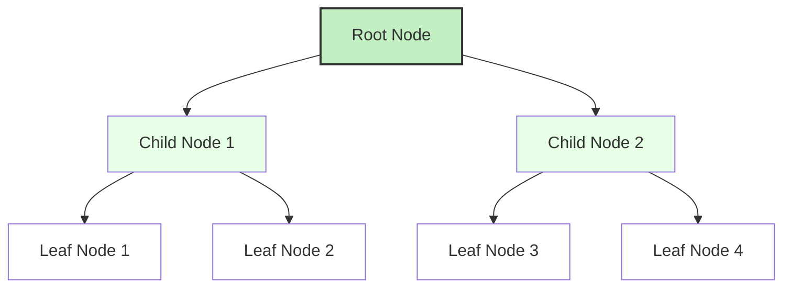
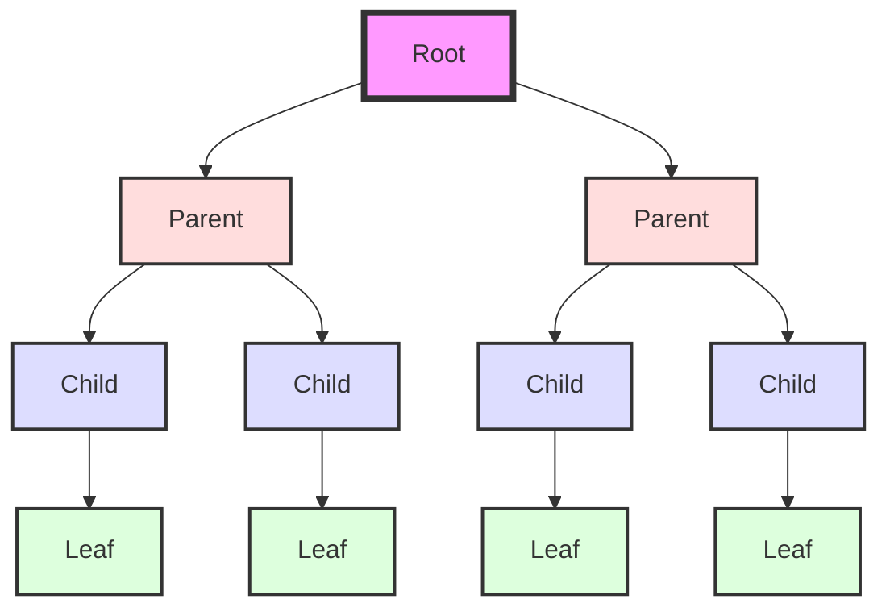
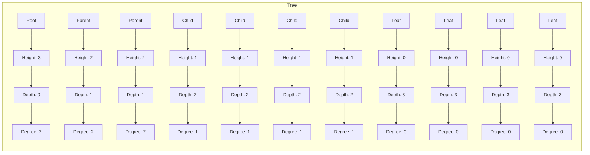
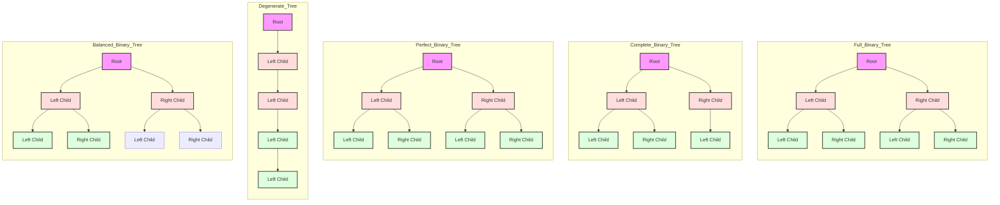

# 🌿 Trees in Java

### 🌱 Introduction to Trees

* A **Tree** is a non-linear hierarchical data structure.
* Consists of nodes connected by edges.
* One node is the **root**; all others are its descendants.
* Trees are acyclic — no loops or cycles.
* Common use-cases: file systems, databases (indexes), hierarchical data modeling.




### 🌿 Basic Terminology

* **Node**: Fundamental unit of a tree that stores data.
* **Root**: Topmost node without a parent.
* **Edge**: Link between two nodes.
* **Leaf**: A node with no children.
* **Parent**: Node with outgoing edges to one or more child nodes.
* **Child**: Node with an incoming edge from a parent node.
* **Subtree**: A tree formed from a node and its descendants.
* **Height**: Length of the longest path from a node to a leaf.
* **Depth**: Number of edges from the root to the node.
* **Degree**: Number of children of a node.

Note:  Here Level starts from 0 for the Root.





### 🌳 Binary Trees

* Each node has at most two children.
* Children are referred to as **left** and **right**.



### 🌲 Representation of Binary Trees

Binary trees can be represented using:

1. **Linked Representation** (most common)

```java
class Node {
    int data;
    Node left, right;

    Node(int value) {
        data = value;
        left = right = null;
    }
}
```

2. **Array Representation** (used in heaps):

* Root at index `0`
* Left child of node at index `i`: `2i + 1`
* Right child of node at index `i`: `2i + 2`
* Parent of node at index `i`: `(i - 1) / 2`


### 🔁 Binary Tree Traversals

Traversal is the process of visiting each node in the tree exactly once.

#### 📌 Inorder Traversal (Left, Root, Right)

Definition: Visit left subtree, root node, then right subtree.

```java
void inorder(Node node) {
    if (node == null) return;
    inorder(node.left);
    System.out.print(node.data + " ");
    inorder(node.right);
}
```

#### 📌 Preorder Traversal (Root, Left, Right)

Definition: Visit root node, then left and right subtrees.

```java
void preorder(Node node) {
    if (node == null) return;
    System.out.print(node.data + " ");
    preorder(node.left);
    preorder(node.right);
}
```

#### 📌 Postorder Traversal (Left, Right, Root)

Definition: Visit left and right subtrees first, then the root.

```java
void postorder(Node node) {
    if (node == null) return;
    postorder(node.left);
    postorder(node.right);
    System.out.print(node.data + " ");
}
```

#### 📌 Level Order Traversal (Breadth-First)

Definition: Visit nodes level by level from top to bottom.

```java
void levelOrder(Node root) {
    if (root == null) return;
    Queue<Node> queue = new LinkedList<>();
    queue.add(root);
    while (!queue.isEmpty()) {
        Node current = queue.poll();
        System.out.print(current.data + " ");
        if (current.left != null) queue.add(current.left);
        if (current.right != null) queue.add(current.right);
    }
}
```


### 🌴 Types of Binary Trees

* **Full Binary Tree**
* **Perfect Binary Tree**
* **Complete Binary Tree**
* **Skewed Tree** (Left or Right)
* **Strict/Proper Binary Tree**: Every internal node has exactly two children.


### 🔍 Binary Search Tree (BST)

```java
Node insert(Node root, int key) {
    if (root == null) return new Node(key);
    if (key < root.data)
        root.left = insert(root.left, key);
    else
        root.right = insert(root.right, key);
    return root;
}

boolean search(Node root, int key) {
    if (root == null) return false;
    if (root.data == key) return true;
    return key < root.data ? search(root.left, key) : search(root.right, key);
}
```


### 🌴 Advanced Trees

* **AVL Tree**
* **Red-Black Tree**
* **Segment Tree**
* **Trie (Prefix Tree)**


### 🖐️ Properties and Formulas

#### 🔢 Number of Binary Trees with n Nodes

* Formula: `C(n) = (2n)! / ((n + 1)! * n!)` → Catalan Number

```java
static long catalanNumber(int n) {
    long res = 1;
    for (int i = 0; i < n; ++i) {
        res *= (2 * n - i);
        res /= (i + 1);
    }
    return res / (n + 1);
}
```

#### 🌿 Labelled Nodes

* Number of labelled binary trees with `n` nodes = `Catalan(n) * n!`

#### 📏 Height vs Nodes

* Minimum height of a binary tree with `n` nodes: `⌈log₂(n + 1)⌉`
* Maximum nodes in height `h`: `2^h - 1`
* Minimum nodes for height `h`: `h + 1`

#### 🧽 Internal vs External Nodes

* `E = I + 1` (E = external nodes, I = internal nodes) in a full binary tree

#### 🌳 N-ary Tree

* A tree in which a node can have at most `N` children

#### 🔀 Strict / Proper / Complete Binary Tree

* **Strict (Proper)**: Each node has 0 or 2 children
* **Complete**: All levels filled except possibly last, filled from left to right

