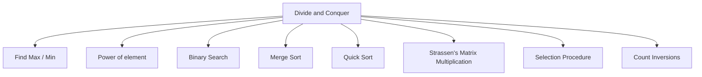
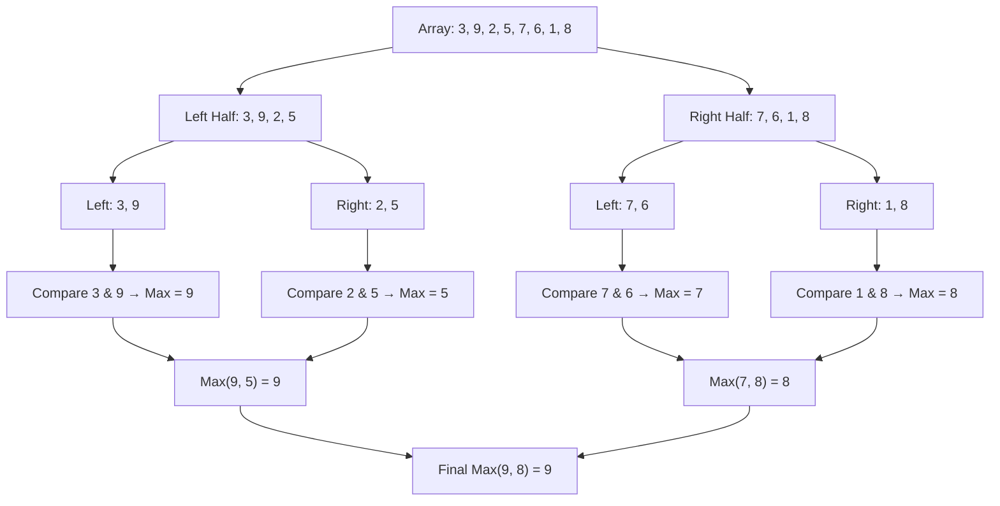

# Divide and Conquer

<ol> 
  <li>When the problem becomes large/complex, then divide the problem into sub-problems, into further sub-problems, until the sub-problem becomes small.</li> 
  <li>Solve the smaller problems, combine their results if required to get the solution of the original problem.</li> 
  <li>In general, a problem is said to be <b>small</b> if it can be solved in one or two basic operations.</li> 
</ol>

### Example : Finding the largest element in an array.

