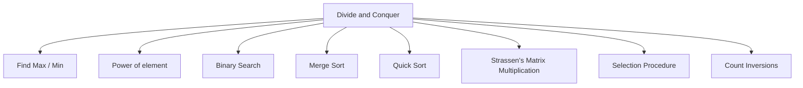
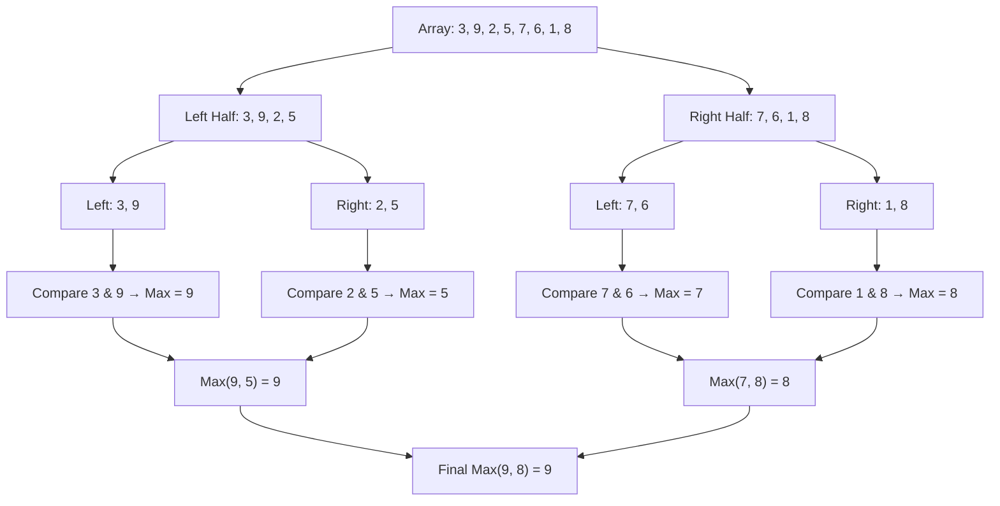

# Divide and Conquer

<ol> 
  <li>When the problem becomes large/complex, then divide the problem into sub-problems, into further sub-problems, until the sub-problem becomes small.</li> 
  <li>Solve the smaller problems, combine their results if required to get the solution of the original problem.</li> 
  <li>In general, a problem is said to be <b>small</b> if it can be solved in one or two basic operations.</li> 
</ol>

```Algorithm
    Algorithm DAndC(P){
        if Small(P) then return S(P);
        else{
          divide P into smaller instances P1,P2,P3...,Pk , (k>=1);
          Apply DAndC to each of these subproblems;
          return Combine(DAndC(P1),DAndC(P2),...,DAndC(PK),);
  }
}

```

<li><b>Control abstraction</b> in algorithms refers to hiding the details of control flow (such as loops, conditionals, recursion, etc.) so that the algorithm focuses more on what needs to be done rather than how it’s done step by step. It helps improve readability, modularity, and reusability.</li>
  Example:- Small(P)



<hr/>

### Example : Finding the largest element in an array.



**Algorithm**

```Algorithm
Function Find-Max(A, low, high)
    // Base Case
    If low == high then
        Return A[low]

    // Divide
    mid ← ⌊(low + high) / 2⌋

    // Conquer
    max1 ← Find-Max(A, low, mid)
    max2 ← Find-Max(A, mid + 1, high)

    // Combine
    If max1 > max2 then
        Return max1
    Else
        Return max2
End Function
```

## Time-Complexity Framework for Divide and Conquer Problems 

    


